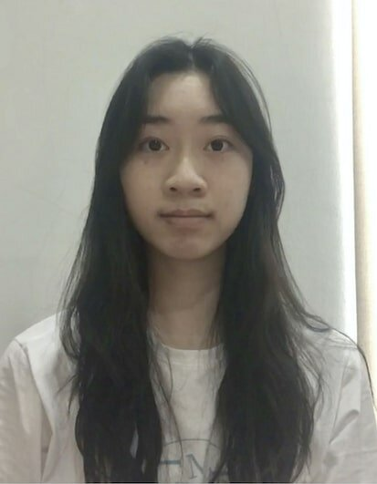
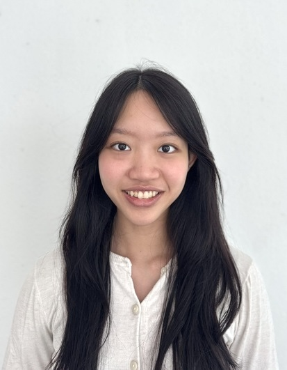
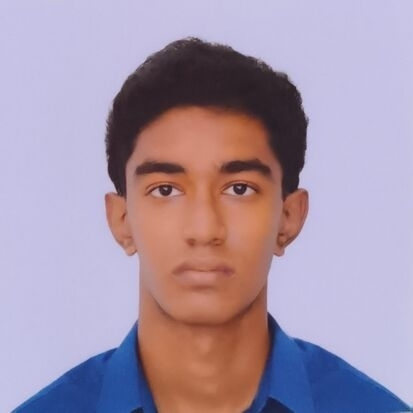
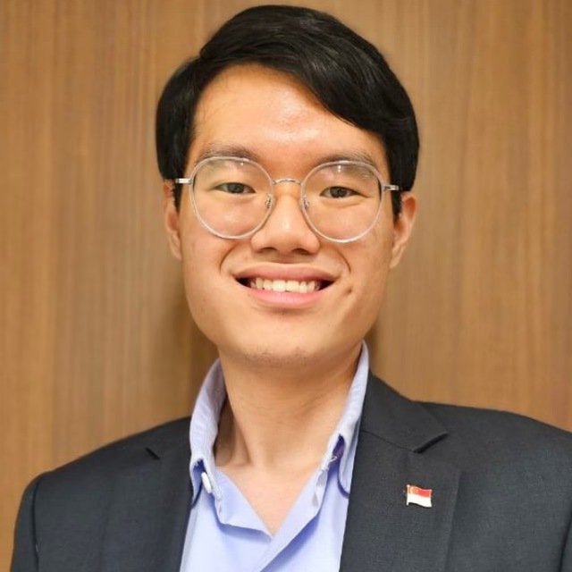

We are a team based in the [School of Computing, National University of Singapore](https://www.comp.nus.edu.sg).

You can reach us at the email `seer[at]comp.nus.edu.sg`

## Project team

### Teo Kai Xin

[[github](https://github.com/johndoe)]
[[portfolio](team/johndoe.md)]

* Role: Project Advisor
* Responsibilities: UI

### Naomi Ng Hui

[[github](http://github.com/nghnaomi)]
[[portfolio](team/nghnaomi.md)]

* Role: Team Lead
* Responsibilities: UI

### Gao Zilin

[[github](http://github.com/gaozilin2005)] [[portfolio](team/johndoe.md)]

* Role: Developer
* Responsibilities: Data

### Chellappan Ramiah

[[github](http://github.com/Chellu19)]
[[portfolio](team/johndoe.md)]

* Role: Developer
* Responsibilities: Backend

### Kee Zhen Xian

[[github](http://github.com/keezhenxian)]
[[portfolio](team/johndoe.md)]

* Role: Developer
* Responsibilities: UI
