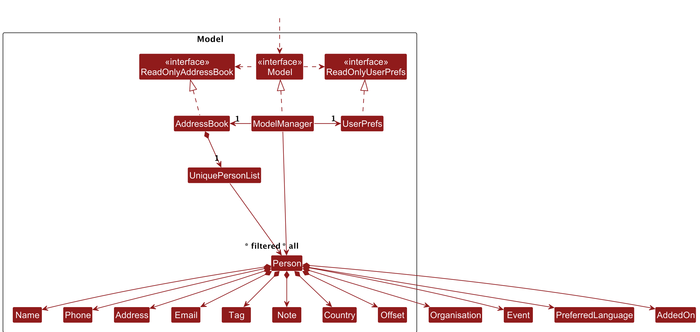
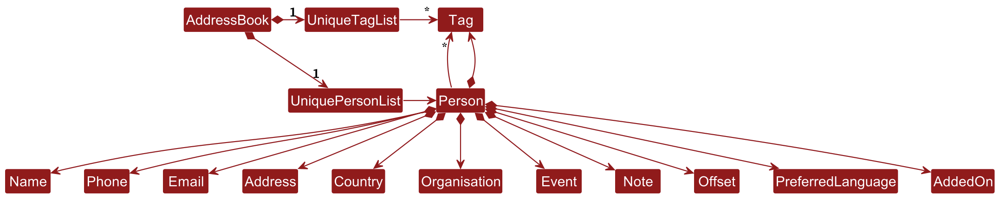

* Table of Contents
{:toc}

--------------------------------------------------------------------------------------------------------------------

## **Acknowledgements**

* * This project is largely based on and a fork of the original [_AB3 codebase_] (https://github.com/nus-cs2103-AY2526S1/tp).
* This documentation page was generated using [_Jekyll_] (https://jekyllrb.com/).
* Libraries used: [_JavaFX_] (https://openjfx.io/), [_Jackson_] (https://github.com/FasterXML/jackson), [_JUnit5_] (https://github.com/junit-team/junit5).

--------------------------------------------------------------------------------------------------------------------

## **Setting up, getting started**

Refer to the guide [_Setting up and getting started_](SettingUp.md).

--------------------------------------------------------------------------------------------------------------------

## **Design**

:bulb: **Tip:** The `.puml` files used to create diagrams are in this document `docs/diagrams` folder. Refer to the [_PlantUML Tutorial_ at se-edu/guides](https://se-education.org/guides/tutorials/plantUml.html) to learn how to create and edit diagrams.

### Architecture

The ***Architecture Diagram*** given above explains the high-level design of the App.

Given below is a quick overview of main components and how they interact with each other.

**Main components of the architecture**

**`Main`** (consisting of classes [`Main`](https://github.com/se-edu/addressbook-level3/tree/master/src/main/java/seedu/address/Main.java) and [`MainApp`](https://github.com/se-edu/addressbook-level3/tree/master/src/main/java/seedu/address/MainApp.java)) is in charge of the app launch and shut down.
* At app launch, it initializes the other components in the correct sequence, and connects them up with each other.
* At shut down, it shuts down the other components and invokes cleanup methods where necessary.

The bulk of the app's work is done by the following four components:

* [**`UI`**](#ui-component): The UI of the App.
* [**`Logic`**](#logic-component): The command executor.
* [**`Model`**](#model-component): Holds the data of the App in memory.
* [**`Storage`**](#storage-component): Reads data from, and writes data to, the hard disk.

[**`Commons`**](#common-classes) represents a collection of classes used by multiple other components.

**How the architecture components interact with each other**

The *Sequence Diagram* below shows how the components interact with each other for the scenario where the user issues the command `delete 1`.

Each of the four main components (also shown in the diagram above),

* defines its *API* in an `interface` with the same name as the Component.
* implements its functionality using a concrete `{Component Name}Manager` class (which follows the corresponding API `interface` mentioned in the previous point.

For example, the `Logic` component defines its API in the `Logic.java` interface and implements its functionality using the `LogicManager.java` class which follows the `Logic` interface. Other components interact with a given component through its interface rather than the concrete class (reason: to prevent outside component's being coupled to the implementation of a component), as illustrated in the (partial) class diagram below.

The sections below give more details of each component.

### UI component

The **API** of this component is specified in [`Ui.java`](https://github.com/se-edu/addressbook-level3/tree/master/src/main/java/seedu/address/ui/Ui.java)

The UI consists of a `MainWindow` that is made up of parts e.g.`CommandBox`, `ResultDisplay`, `PersonListPanel`, `StatusBarFooter` etc. All these, including the `MainWindow`, inherit from the abstract `UiPart` class which captures the commonalities between classes that represent parts of the visible GUI.

The `UI` component uses the JavaFx UI framework. The layout of these UI parts are defined in matching `.fxml` files that are in the `src/main/resources/view` folder. For example, the layout of the [`MainWindow`](https://github.com/se-edu/addressbook-level3/tree/master/src/main/java/seedu/address/ui/MainWindow.java) is specified in [`MainWindow.fxml`](https://github.com/se-edu/addressbook-level3/tree/master/src/main/resources/view/MainWindow.fxml)

The `UI` component,

* executes user commands using the `Logic` component.
* listens for changes to `Model` data so that the UI can be updated with the modified data.
* keeps a reference to the `Logic` component, because the `UI` relies on the `Logic` to execute commands.
* depends on some classes in the `Model` component, as it displays `Person` object residing in the `Model`.

### Logic component

**API** : [`Logic.java`](https://github.com/se-edu/addressbook-level3/tree/master/src/main/java/seedu/address/logic/Logic.java)

Here's a (partial) class diagram of the `Logic` component:

The sequence diagram below illustrates the interactions within the `Logic` component, taking `execute("delete 1")` API call as an example.

:information_source: **Note:** The lifeline for `DeleteCommandParser` should end at the destroy marker (X) but due to a limitation of PlantUML, the lifeline continues till the end of diagram.

How the `Logic` component works:

1. When `Logic` is called upon to execute a command, it is passed to an `AddressBookParser` object which in turn creates a parser that matches the command (e.g., `DeleteCommandParser`) and uses it to parse the command.
1. This results in a `Command` object (more precisely, an object of one of its subclasses e.g., `DeleteCommand`) which is executed by the `LogicManager`.
1. The command can communicate with the `Model` when it is executed (e.g. to delete a person). 
   Note that although this is shown as a single step in the diagram above (for simplicity), in the code it can take several interactions (between the command object and the `Model`) to achieve.
1. The result of the command execution is encapsulated as a `CommandResult` object which is returned back from `Logic`.

Here are the other classes in `Logic` (omitted from the class diagram above) that are used for parsing a user command:

How the parsing works:
* When called upon to parse a user command, the `AddressBookParser` class creates an `XYZCommandParser` (`XYZ` is a placeholder for the specific command name e.g., `AddCommandParser`) which uses the other classes shown above to parse the user command and create a `XYZCommand` object (e.g., `AddCommand`) which the `AddressBookParser` returns back as a `Command` object.
* All `XYZCommandParser` classes (e.g., `AddCommandParser`, `DeleteCommandParser`, ...) inherit from the `Parser` interface so that they can be treated similarly where possible e.g, during testing.

### Model component
**API** : [`Model.java`](https://github.com/se-edu/addressbook-level3/tree/master/src/main/java/seedu/address/model/Model.java)

The `Model` component,

* stores the address book data i.e., all `Person` objects (which are contained in a `UniquePersonList` object).
* stores the currently 'selected' `Person` objects (e.g., results of a search query) as a separate _filtered_ list which is exposed to outsiders as an unmodifiable `ObservableList<Person>` that can be 'observed' e.g. the UI can be bound to this list so that the UI automatically updates when the data in the list change.
* stores a `UserPref` object that represents the user’s preferences. This is exposed to the outside as a `ReadOnlyUserPref` objects.
* does not depend on any of the other three components (as the `Model` represents data entities of the domain, they should make sense on their own without depending on other components)

:information_source: **Note:** An alternative (arguably, a more OOP) model is given below. It has a `Tag` list in the `AddressBook`, which `Person` references. This allows `AddressBook` to only require one `Tag` object per unique tag, instead of each `Person` needing their own `Tag` objects. 

### Extended Person Model

The `Person` class has been extended to support a new compulsory field:
- **`Offset`**: Timezone offset from UTC (e.g., "+08:00").

The `Person` class has been extended to support new optional fields:
- **`AddedOn`**: Records the exact date and time the contact was added.
- **`Country`**: Represents the person's country of origin or association.
- **`Organisation`**: Represents the institution (e.g., company, school) the person is affiliated with.
- **`Event`**: Records meeting contexts or future interactions (e.g., "Met at NUS Career Fair").
- **`CommunicationChannel`**: Mode or platform for communication.
- **`PreferredLanguage`**: Language preference for communication (e.g., "English").
- **`Note`**: Stores cultural or personal notes (e.g., "Prefers Western cuisine").
- **`isArchived`**: Tracks whether a contact has been archived or not.

- The Offset, Country, CommunicationChannel, PreferredLanguage fields are validated.
- The AddedOn and isArchived fields cannot be added or edited via the add or edit commands.
- All the fields are fully serializable to JSON.
- The fields are positioned in the constructor as: `(Name, Phone, Email, Address, Country, Country, Organisation, Event, Note, CommunicationChannel, Tag, UTC Offset, PreferredLanguage, AddedOn, isArchived)`

### Storage component

**API** : [`Storage.java`](https://github.com/se-edu/addressbook-level3/tree/master/src/main/java/seedu/address/storage/Storage.java)

The `Storage` component,
* can save both address book data and user preference data in JSON format, and read them back into corresponding objects.
* inherits from both `AddressBookStorage` and `UserPrefStorage`, which means it can be treated as either one (if only the functionality of only one is needed).
* depends on some classes in the `Model` component (because the `Storage` component's job is to save/retrieve objects that belong to the `Model`)

### Common classes

Classes used by multiple components are in the `seedu.address.commons` package.

--------------------------------------------------------------------------------------------------------------------

## **Implementation**

This section describes some noteworthy details on how certain features are implemented.

### \[Proposed\] Undo/redo feature

#### Proposed Implementation

The proposed undo/redo mechanism is facilitated by `VersionedAddressBook`. It extends `AddressBook` with an undo/redo history, stored internally as an `addressBookStateList` and `currentStatePointer`. Additionally, it implements the following operations:

* `VersionedAddressBook#commit()` — Saves the current address book state in its history.
* `VersionedAddressBook#undo()` — Restores the previous address book state from its history.
* `VersionedAddressBook#redo()` — Restores a previously undone address book state from its history.

These operations are exposed in the `Model` interface as `Model#commitAddressBook()`, `Model#undoAddressBook()` and `Model#redoAddressBook()` respectively.

Given below is an example usage scenario and how the undo/redo mechanism behaves at each step.

Step 1. The user launches the application for the first time. The `VersionedAddressBook` will be initialized with the initial address book state, and the `currentStatePointer` pointing to that single address book state.

Step 2. The user executes `delete 5` command to delete the 5th person in the address book. The `delete` command calls `Model#commitAddressBook()`, causing the modified state of the address book after the `delete 5` command executes to be saved in the `addressBookStateList`, and the `currentStatePointer` is shifted to the newly inserted address book state.

Step 3. The user executes `add n/David …​` to add a new person. The `add` command also calls `Model#commitAddressBook()`, causing another modified address book state to be saved into the `addressBookStateList`.

:information_source: **Note:** If a command fails its execution, it will not call `Model#commitAddressBook()`, so the address book state will not be saved into the `addressBookStateList`.

Step 4. The user now decides that adding the person was a mistake, and decides to undo that action by executing the `undo` command. The `undo` command will call `Model#undoAddressBook()`, which will shift the `currentStatePointer` once to the left, pointing it to the previous address book state, and restores the address book to that state.

:information_source: **Note:** If the `currentStatePointer` is at index 0, pointing to the initial AddressBook state, then there are no previous AddressBook states to restore. The `undo` command uses `Model#canUndoAddressBook()` to check if this is the case. If so, it will return an error to the user rather
than attempting to perform the undo.

The following sequence diagram shows how an undo operation goes through the `Logic` component:

:information_source: **Note:** The lifeline for `UndoCommand` should end at the destroy marker (X) but due to a limitation of PlantUML, the lifeline reaches the end of diagram.

Similarly, how an undo operation goes through the `Model` component is shown below:

The `redo` command does the opposite — it calls `Model#redoAddressBook()`, which shifts the `currentStatePointer` once to the right, pointing to the previously undone state, and restores the address book to that state.

:information_source: **Note:** If the `currentStatePointer` is at index `addressBookStateList.size() - 1`, pointing to the latest address book state, then there are no undone AddressBook states to restore. The `redo` command uses `Model#canRedoAddressBook()` to check if this is the case. If so, it will return an error to the user rather than attempting to perform the redo.

Step 5. The user then decides to execute the command `list`. Commands that do not modify the address book, such as `list`, will usually not call `Model#commitAddressBook()`, `Model#undoAddressBook()` or `Model#redoAddressBook()`. Thus, the `addressBookStateList` remains unchanged.

Step 6. The user executes `clear`, which calls `Model#commitAddressBook()`. Since the `currentStatePointer` is not pointing at the end of the `addressBookStateList`, all address book states after the `currentStatePointer` will be purged. Reason: It no longer makes sense to redo the `add n/David …​` command. This is the behavior that most modern desktop applications follow.

The following activity diagram summarizes what happens when a user executes a new command:

#### Design considerations:

**Aspect: How undo & redo executes:**

* **Alternative 1 (current choice):** Saves the entire address book.
  * Pros: Easy to implement.
  * Cons: May have performance issues in terms of memory usage.

* **Alternative 2:** Individual command knows how to undo/redo by
  itself.
  * Pros: Will use less memory (e.g. for `delete`, just save the person being deleted).
  * Cons: We must ensure that the implementation of each individual command are correct.

## **Advanced Features**

### Archiving Contacts

The app now supports **archiving and unarchiving** contacts to help users keep their address book relevant and organised.

#### Commands

| Action        | Command Format & Example |
|---------------|-------------------------|
| Archive       | `archive INDEX`   e.g., `archive 1` → archives the first contact in the current view. |
| Unarchive     | `unarchive INDEX`   e.g., `unarchive 2` → restores the second contact from the archived list. |
| List Archives | `archivelist`   e.g., `archivelist` → displays all archived contacts. |

#### Implementation

- Each `Person` object contains an **archival status** flag (`true` for archived, `false` for unarchived`).
- **Archiving a person** (`ArchiveCommand`) replaces the original `Person` in the model with a copy that has `archivalStatus = true`.
- **Unarchiving** (`UnarchiveCommand`) similarly creates a copy with `archivalStatus = false`.
- `ArchiveListCommand` updates the filtered list to show only archived contacts.
- When `archive` or `unarchive` is run, the list returns to the main list and the archive list respectively, preserving any prior sorting order.
- If there are no contacts in the archive list after unarchiving the last one, the display will return to the main list instead.
- Commands validate the index against the current filtered list and return appropriate errors if:
    - Index is invalid
    - Contact is already archived/unarchived

#### Interaction with Model and UI

- Commands update the **filtered person list** in the `Model` via predicates:
    - `PREDICATE_SHOW_ALL_UNARCHIVED` → shows only active contacts
    - `PREDICATE_SHOW_ALL_ARCHIVED` → shows only archived contacts
- The UI observes the filtered list and automatically refreshes when changes occur.
- Archiving does **not remove contacts from storage**, preserving the full address book.

#### Example Scenario

1. User executes `archive 1` on the first contact:
    - `ArchiveCommand` validates the index.
    - Creates a new `Person` object with `archivalStatus = true`.
    - Updates the `Model` and refreshes the view to show only unarchived contacts.
2. User executes `archivelist`:
    - `ArchiveListCommand` updates the filtered list to show archived contacts only.
3. User executes `unarchive 1`:
    - `UnarchiveCommand` validates the index in the archived list.
    - Replaces the archived person with an unarchived version.
    - Updates the view to show archived contacts or returns to unarchived view depending on predicate.

#### Manual Test Cases

| Test | Command | Expected Outcome                                                  |
|------|---------|-------------------------------------------------------------------|
| Archive a contact | `archive 1` | Contact is moved from unarchived list; success message displayed. |
| List archives | `archivelist` | Only archived contacts displayed.                                 |
| Unarchive a contact | `unarchive 1` | Contact restored to unarchived list; success message displayed.   |
| Unarchive an unarchived contact | `unarchive 1` | Error message: The person index provided is invalid. |             |

---

### Sorting Contacts

The app also supports sorting contacts by various criteria:

| Action              | Command Format & Example                                                              |
|---------------------|---------------------------------------------------------------------------------------|
| Sort by Name        | `sortname`   e.g., `sortname` → sorts all visible contacts alphabetically by name. |
| Sort by Country     | `sortcountry`   e.g., `sortcountry` → sorts contacts alphabetically by country.    |
| Sort by Add On Date | `sortdate`   e.g., `sortdate` → sorts contacts chronologically by added on date.   |

#### Implementation

- Sorting operates on the **filtered list** in the `Model` so it respects current filters (e.g., after `find`, `archivelist`).
- The `ObservableList` is updated after sorting, triggering automatic UI refresh.
- Sorting is **stable**: contacts with equal keys maintain their relative order.

#### Manual Test Cases

| Test               | Command | Expected Outcome                                       |
|--------------------|---------|--------------------------------------------------------|
| Sort by name       | `sortname` | Contacts listed alphabetically by name.                |
| Sort by country    | `sortcountry` | Contacts listed alphabetically by country.             |
| Sort by date added | `sortdate` | Contacts listed from earliest to latest added on date. |
| Sort after find    | `find Singapore` then `sortname` | Only filtered contacts are sorted; others hidden.      |

---

### Finding Contacts

The app also supports finding contacts by various criteria:

| Action               | Command Format & Example                                                                                        |
|----------------------|-----------------------------------------------------------------------------------------------------------------|
| Find by Name         | `find NAME`   e.g., `find John` → displays John's contact card if he is in the addressbook.                  |
| Find by Country      | `findcountry COUNTRY`   e.g., `findcountry Singapore` → lists all the contacts with country field Singapore. |
| Find by Organisation | `findorganisation`   e.g., `findorganisation NUS` → lists contacts with organisation NUS.                    |
| Find by Tag | `findtag`   e.g., `findtag friends` → lists contacts with tag friends. |

- `find`, `findcountry`, `findorganisation` and `findtag` are implemented similarly.
- The following implementation details, design choices, and manual test cases are given for `findcountry` only.

#### Implementation

- `FindCountryCommandParser` (not shown) trims the raw argument and builds a `Country` value. 
- Construction validates against `Country.isValidCountry(...)`, which accepts only ISO country display names in English (e.g., “Singapore”, “United States”, “China”).
- `FindCountryCommand` encapsulates a `CountryContainsKeywordPredicate` which holds the target `Country`. 
- The predicate returns true if `person.getCountry().equals(targetCountry)`. This is an exact match on the `Country` value (which is inherently case-insensitive). Contacts without a country (empty value) do not match any country.
- The model replaces the current filter with the country predicate on the model’s filtered list. JavaFX observes the list and the UI refreshes automatically.

### Design choices

- Exact country names only: Ensures consistency with the `Country` domain object, which validates names against the ISO list (English display names).
- Case-insensitive match: Matches `Country`’s validation semantics.

#### Manual Test Cases

| Test                               | Command                          | Expected Outcome                                                   |
|------------------------------------|----------------------------------|--------------------------------------------------------------------|
| Find valid country with matches    | `findcountry China`              | Only contacts whose country is exactly China are listed; result count shown. |
| Find valid country with no matches | `findcountry Malaysia`           | “0 persons listed!” and the list becomes empty.                    |
| Find invalid country | `findcountry Singapur` | Error: invalid command format with usage; no change to the current list. |
--------------------------------------------------------------------------------------------------------------------

## **Documentation, logging, testing, configuration, dev-ops**

* [Documentation guide](Documentation.md)
* [Testing guide](Testing.md)
* [Logging guide](Logging.md)
* [Configuration guide](Configuration.md)
* [DevOps guide](DevOps.md)

--------------------------------------------------------------------------------------------------------------------

## **Appendix: Requirements**

### Product scope

**Target user profile**:

* Exchange students on short-term programs abroad are adventurous and eager to maximise their limited time.
* They simultaneously juggle academics, cultural exploration, and networking.
* They face challenges remembering people, maintaining connections, remembering cultural details, timezones, languages, and managing scattered communication across different apps.
* Their goals are forging lasting friendships and global networks.

**Value proposition**: manage contacts faster than a typical mouse/GUI driven app

Our app helps exchange students build and sustain meaningful global connections while avoiding cultural missteps.
Centralising contacts with their details, including country, language, organisation, event where they met, timezone, preferred communication channels, and notes makes it easier to remember people and cultural nuances.
Unlike traditional contact books with restricted fields, it’s tailored for short but intense exchange journeys, ensuring friendships and networks last beyond the program.

### User stories

|    | Profile As a…                                     | Feature I can…                                                                       | Benefit so that I can…                                                                                | Priority |
| -- | ---------------------------------------------------- | --------------------------------------------------------------------------------------- | -------------------------------------------------------------------------------------------------------- | -------- |
| 1  | user                                                 | add a contact                                                                           | track the people I've met                                                                                | High     |
| 2  | user                                                 | delete a contact                                                                        | keep my network and knowledge tidy and relevant.                                                         | High     |
| 3  | user                                                 | view all my contacts                                                                    | easily recall who I met.                                                                                 | High     |
| 4  | user                                                 | add cultural notes                                                                      | recall important details about them.                                                                     | High     |
| 5  | sociable user who meets people from different places | tag contacts with “where we met” labels (e.g. “business course”, “xx networking event”) | remember the context in which I met them.                                                                | High     |
| 6  | user                                                 | edit a contact                                                                          | fix any errors I made when adding a contact.                                                             | High     |
| 7  | forgetful user                                       | search my contacts by name                                                              | find the right person even if I forget their exact name.                                                 | High     |
| 8  | first-time exchange student user                     | get help with the commands                                                              | know how to use the app.                                                                                 | Medium   |
| 9  | busy exchange student                                | centralise and track all my trip-related contacts and cultural notes in the app         | save time switching between scattered apps.                                                              | Medium   |
| 10 | sociable user who meets many people                  | tag contacts with role labels (e.g. “classmate,” “local buddy,” “travel buddy”),     | organise people by roles.                                                                                | Medium   |
| 11 | forgetful user                                       | filter contacts by the country I met them in                                            | find people when I don’t remember anything except where we met.                                          | Medium   |
| 12 | user                                                 | filter contacts by tag                                                                  | find people I am looking for based on the role required.                                                 | Medium   |
| 13 | user who cannot remember everyone’s time zones       | have every contact’s local time displayed                                               | avoid contacting them at odd hours.                                                                      | Medium   |
| 14 | user who cannot remember everyone’s preferences      | have every contact’s preferred communication channel listed                             | contact them on the platform that they are most comfortable with.                                        | Medium   |
| 15 | first-time exchange student user                     | see sample contacts and notes when I open the app                                       | immediately explore how to organise people and cultural details without having to add my own data first. | Low      |
| 16 | user                                                 | view a timeline of interactions and trips                                               | reflect on my exchange journey after it ends.                                                            | Low      |
| 17 | user                                                 | import contacts from my phone or social apps                                            | quickly populate my network without manually typing everything.                                          | Low      |
| 18 | user                                                 | set reminders to follow up with friends                                                 | keep connections alive beyond a single meeting.                                                          | Low      |
| 19 | organised user                                       | archive contacts                                                                        | keep my network relevant.                                                                                | Low      |
| 20 | auditory learner                                     | record the pronunciation of contacts’ names                                             | remember the pronunciation of names that are foreign to me.                                              | Low      |
| 21 | visual user                                          | create map visuals to visualise networks                                                | so that I can see clusters of connections easily.                                                        | Low      |

### Use cases

(For all use cases below, the **System** is the `Worldly` and the **Actor** is the `user`, unless specified otherwise)

**Use case: UC01 Add a Contact**

Actor: User

**MSS**

1. User chooses to add someone to their contacts.
2. User types the add command with required fields (name, phone, email, address, offset) and any optional fields (country, organisation, event, note, tags, channel, language).
3. Worldly validates each field (format, length, allowed values) and checks for duplicates.
4. If all fields are valid and limits are not exceeded, the system adds the new contact to the list.
5. The new contact appears in the contact list view (respecting the current sort and archive filter).

    Use case ends.

**Extensions**
3a. Any field invalid → Worldly shows an error message indicating the offending field(s).
3b. Contact already exists (by identity; name is case-insensitive) → Worldly shows “This person already exists.”
3c. Address book has reached 500 contacts → Worldly shows “Maximum of 500 contacts reached.”

 

**Use Case: UC02 View Contacts**

Actor: User

**MSS**

1. User chooses to view contacts.
2. User types list. 
3. System retrieves all unarchived contacts and applies the current sort mode (name/country/date). The sort mode is name by default.
4. System displays contacts with every specified field (name, country, note preview, etc.) in the list.

    Use case ends.

**Extensions**
3a. User changes sort → User types sortname / sortcountry / sortdate; list reorders accordingly and the mode persists.

 

**Use Case: UC03 Delete Contact**

Actor: User

**MSS**

1. User chooses to delete a contact.
2. User types the delete INDEX command.
3. System validates the index against the currently displayed list.
4. If valid, the system deletes the contact. The contact no longer appears in the list.

    Use case ends.

**Extensions**
3a. Index invalid (non-numeric/out of bounds) → System shows “Invalid index.”

 

**Use Case: UC04 Edit Contact**

Actor: User

**MSS**

1. User chooses to edit a contact.
2. User types edit INDEX with one or more fields to change.
3. System validates changed fields and checks for duplicates if identity fields change. 
4. If valid, the system updates the contact. 
5. Updated details appear in the list.

    Use case ends.

**Extensions**
3a. No fields provided → System shows “At least one field to edit must be provided.”
3b. Any edited field invalid (same rules as UC01) → System shows an appropriate error message.
3c. Duplicate prefixes (e.g., two emails) → System shows a duplicate-prefix error.
3d. Change causes duplicate person → System shows duplicate-person error.

 

**Use Case: UC05 Find by Country**

Actor: User

**MSS**

1. User chooses to filter by country.
2. User types findcountry COUNTRY.
3. System applies a country-equality predicate (case-insensitive) to the current view (archived/unarchived).
4. System shows only matching contacts and displays “X persons listed!”.

    Use case ends.

**Extensions**
2a. COUNTRY not recognized (not in ISO list) → System rejects during parsing and shows an error.
3a. No matches → System shows “0 persons listed!” and displays an empty list.
3b. User sorts after find → Sort applies to the filtered subset only; the filter remains active.

 

**Use Case: UC06 Find by Tag**

Actor: User

**MSS**

1. User chooses to locate contacts with specific tags.
2. User types findtag t/TAG [t/TAG]....
3. System filters contacts that contain all specified tags.
4. System shows matching contacts and “X persons listed!”.

    Use case ends.

**Extensions**
2a. No `tag: TAG` provided → System shows invalid command format with usage.
3a. No matches → System shows “0 persons listed!”.

 

**Use Case: UC07 Sort Contacts**

Actor: User

**MSS**

1. User chooses how to order the current list. 
2. User types sortname / sortcountry / sortdate. 
3. System sorts the underlying list accordingly and persists the sort mode. 
4. UI refreshes to reflect the new order, respecting any active filters and the current archive view.

    Use case ends.

**Extensions**
2a. Sorting while viewing archived list → Sort applies and Worldly stays on archived view.
2b. Contacts with no country in sortcountry → They appear last (stable order within that bucket).

 

**Use Case: UC08 Archive / Unarchive Contact**

Actor: User

**MSS**

1. User chooses to archive a contact.
2. User types archive INDEX.
3. System validates index and marks the contact as archived.
4. Archived contact disappears from list and is visible in archivelist.

    Use case ends.

**Extensions**
2a. Invalid index → System shows “Invalid index.”
4a. User unarchives from the archived view using unarchive INDEX → Contact returns to the unarchived list; sort mode is reapplied.

 

**Use Case: UC09 View Timeline (Added On)**

Actor: User

**MSS**

1. User wants to see contacts by when they were added on.
2. User types sortdate. 
3. System sorts by the stored timestamp (AddedOn) in ascending chronological order. 
4. UI displays the timeline order.

    Use case ends.

**Extensions**
2a. Some contacts have identical timestamps → Stable sort preserves their relative order.
2b. A contact missing the timestamp → System ensures the field is set at creation; absence is treated as invalid data and rejected earlier (UC01).

 

**Use Case: UC10 Help**

Actor: User

**MSS**

1. User needs guidance on commands and country/language lists, and country codes for calling. 
2. User types help. 
3. System opens the Help window with command summaries and validated lists (e.g., countries, language options, country codes).

    Use case ends.

**Extensions**
3a. Help window already minimized → System brings the existing window to front (user may need to restore it if OS keeps it minimized).

### Non-Functional Requirements

1.  Should work on any _mainstream OS_ as long as it has Java `17` or above installed.
2.  Should be able to hold up to 500 persons without a noticeable sluggishness in performance for typical usage.
3.  A user with above average typing speed for regular English text (i.e. not code, not system admin commands) should be able to accomplish most of the tasks faster using commands than using the mouse.
4. The system should respond within two seconds.
6. The user interface should be intuitive enough for users who are not IT-savvy.
7. The system is offered as a free offline service.

### Glossary

* **Mainstream OS**: Windows, Linux, Unix, MacOS.
* **Archived Contact**: A contact marked as “archived,” meaning it is hidden from the main list but retrievable via the archivelist command.
* **Unarchived Contact**: A contact that is currently visible in the main list.
* **Communication Channel**: The contact’s preferred mode of communication (e.g., Phone, Email, SMS, WhatsApp, Telegram).
* **Offset**: The contact’s time zone difference from GMT, represented as +HH:MM or -HH:MM.
* **Organisation**: The institution (e.g., company, university) a contact is affiliated with.
* **Event**: A recorded interaction or planned meeting with a contact.
* **AddedOn**: A timestamp recording when a contact was added to or first met by the user. Used for chronological sorting.

--------------------------------------------------------------------------------------------------------------------

## **Appendix: Instructions for manual testing**

Given below are instructions to test the app manually.

:information_source: **Note:** These instructions only provide a starting point for testers to work on;
testers are expected to do more *exploratory* testing.

### Launch and shutdown

1. Initial launch

   1. Download the jar file and copy into an empty folder

   1. Double-click the jar file Expected: Shows the GUI with a set of sample contacts. The window size may not be optimum.

1. Saving window preferences

   1. Resize the window to an optimum size. Move the window to a different location. Close the window.

   1. Re-launch the app by double-clicking the jar file. 
       Expected: The most recent window size and location is retained.

### Adding a person

1. Add a valid contact

    1. Prerequisites: List all contacts using list.

    2. Test case:   add n/Alex Tan p/91234567 e/alex@gmail.com a/123 Clementi Rd o/NUS c/Singapore off/+08:00   Expected: Contact successfully added. Appears at the correct sorted position. Confirmation message shown in status bar.

2. Add a duplicate contact

    1. Test case:  Repeat the previous command.   Expected: Error message “This person already exists.”

3. Add with missing required fields

    1. Test case:   add n/Alex Tan e/alex@gmail.com a/123 Clementi Rd off/+08:00   Expected: Error message indicating missing p/PHONE.

### Editing a person

1. Edit all fields of a contact

    1. Prerequisites: Contact list contains at least one person.

    2. Test case:   edit 1 n/Bob Tan p/98765432 e/bob@gmail.com a/456 Bukit Timah Rd c/Malaysia off/+07:00   Expected: Contact’s details updated. Success message shown.

2. Edit a single field

    1. Test case:   edit 1 n/Bobby Tan   Expected: Only the name field changes. Other fields remain unchanged.

### Deleting a person

1. Deleting a person while all persons are being shown

   1. Prerequisites: List all persons using the `list` command. Multiple persons in the list.

   2. Test case: `delete 1` 
      Expected: First contact is deleted from the list. Details of the deleted contact shown in the status message. Timestamp in the status bar is updated.

   3. Test case: `delete 0` 
      Expected: No person is deleted. Error details shown in the status message. Status bar remains the same.

   4. Other incorrect delete commands to try: `delete`, `delete x`, `...` (where x is larger than the list size) 
      Expected: Similar to previous.

### Finding contacts

1. There is a contact added with name John, country Singapore, tag friends and organisation NUS.

2. Find by country

    1. Testcase: `findcountry Singapore`  Expected: John is listed.

3. Find by country fails

    1. Testcase: `findcountry Malaysia`  Expected: 0 contacts are listed.

4. Find by tag

    1. Testcase: `findtag friends`  Expected: John is listed.

5. Find by name

    1. Testcase: `find John`  Expected: John is listed.

6. Find by organisation

    1. Testcase: `findorganisation NUS`  Expected: John is listed.

### Sorting contacts

1. Sort by name

    1. Prerequisites: Multiple contacts with varying names.

    2. Test case: sortname   Expected: Contacts are listed alphabetically by name.

2. Sort by country

    1. Test case: sortcountry   Expected: Contacts are sorted alphabetically by country. Those with no country appear last.

3. Sort by date

    1. Test case: sortdate   Expected: Contacts appear in order of when they were added.

4. Sort persistence

    1. Test case: Sort the list, then add a new contact.   Expected: Sort mode remains active; new contact appears in the correct sorted position.

### Archiving and Unarchiving

1. Archive a contact

    1. Prerequisites: At least one unarchived contact in view.

    2. Test case: archive 1   Expected: Contact disappears from list. Success message shown.

2. Unarchive a contact

    1. Test case: archivelist then unarchive 1   Expected: Contact reappears in main list. Sort order preserved.

3. Invalid archive index

    1. Test case: archive 99   Expected: “Invalid index.”

### Saving data

1. Dealing with missing/corrupted data files

    1. Exit app. Delete or corrupt the addressbook.json file (e.g., remove closing braces).

    2. Relaunch app.   Expected: Application starts with an empty address book and shows an error in the console or alert window.

2. Automatic saving

    1. Perform several add/delete/edit operations. Close the app.

    2. Relaunch.   Expected: All changes persist; no data loss.
